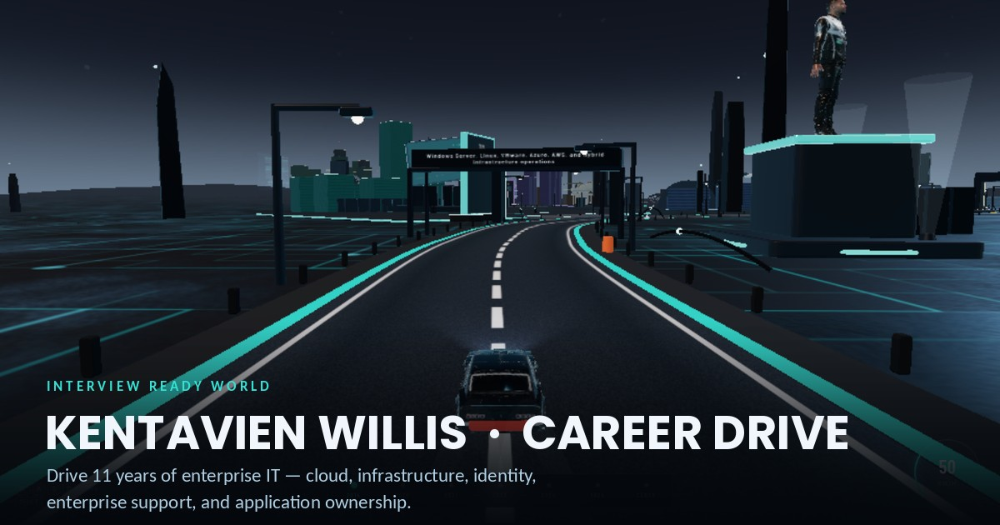

# Kentavien Willis — Career Drive

**Live: https://kentavienwillis-dev.github.io/career-drive/**

A game-first 3D career portfolio. No scrolling page, no landing-page sections — it loads
straight into a world you drive through. One mile of road, six company districts, and a
certifications summit, built for hiring teams reviewing enterprise IT experience.

---

## Controls

**Desktop** — `W A S D` / arrows to drive · `SHIFT` to break traction · `E` opens a chapter ·
`C` cycles camera (chase / low chase / hood / cinematic) · `M` route map · `H` hides the
interface for clean screenshots · `R` restarts · `ESC` closes panels

**Mobile** — press and hold anywhere, then swipe: up accelerates, down brakes and reverses,
left and right steer. How far you push sets how much.

**Auto Tour** — the second button on the title card drives itself, parks at every district
and opens each chapter. Built for someone who won't learn controls. Any input takes back
manual control instantly.

**Deep links** — `#tsys` `#aflac` `#boeing` `#stefanini` `#fcb` `#aldridge` `#summit` drop a
visitor straight into that district.

---

## The route

| Chapter | Years | Role | Landmark |
|---|---|---|---|
| TSYS | 2014–2020 | System Administrator | **Payment Core Array** — a 26 m payment card over rack clusters |
| Aflac | 2020–2021 | Technical Support Lead | **Care Signal Duck** — support beacon with ripple rings |
| Boeing | 2021–2023 | Application Support Analyst | **Flight Reliability Cruiser** — airliner on an exhibit pylon |
| Stefanini | 2023–2024 | Senior Help Desk Engineer Lead | **Digital Workplace Hub** — command deck, monitor wall, headset arc |
| First Citizens Bank | 2024–2025 | System Administrator | **Vault Tower District** — twin towers, vault door, bank facade |
| Aldridge Pite LLC | 2025–2026 | Application Systems Administrator | **Workflow Justice Arch** — scales of justice, gavel, courthouse |
| Summit | Active | 7 certifications | Certification monoliths and impact pedestal |

Between districts, overhead gantries carry the capability pillars, so the road keeps making
the case even where there's nothing to park at.

---

## Build

Everything is one self-contained `index.html` (~3.2 MB) — geometry, textures, materials and
audio are generated procedurally in the browser at load. The car and the statue are the only
external assets, and they're embedded as base64 data URIs so there is no folder structure to
get wrong.

- **three.js r170**, WebGL2, ACES filmic tone mapping, PMREM environment probe
- **Post chain** (desktop): render → bloom → custom grade shader (district tint, speed-driven
  chromatic fringe, vignette, grain) → output
- **Quality tiering** — touch devices and low-core machines skip post-processing and shadows,
  cap pixel ratio and build fewer props; resolution scales dynamically if the frame rate drops
- **~630 draw calls / ~690k triangles**, district architecture merged into single geometries,
  repeated props instanced
- **Handling** — kinematic bicycle model with speed-dependent steering, lateral slip, a
  suspension spring the world can kick, and 84 knockable props
- **Audio** — engine note synthesised with WebAudio oscillators, off by default

Requires WebGL2 and network on first load for three.js (jsDelivr) and two webfonts.

---

Content is sourced from the July 2026 resume — roles, tools, metrics and progression are real.

**kentavienwillis@gmail.com**
